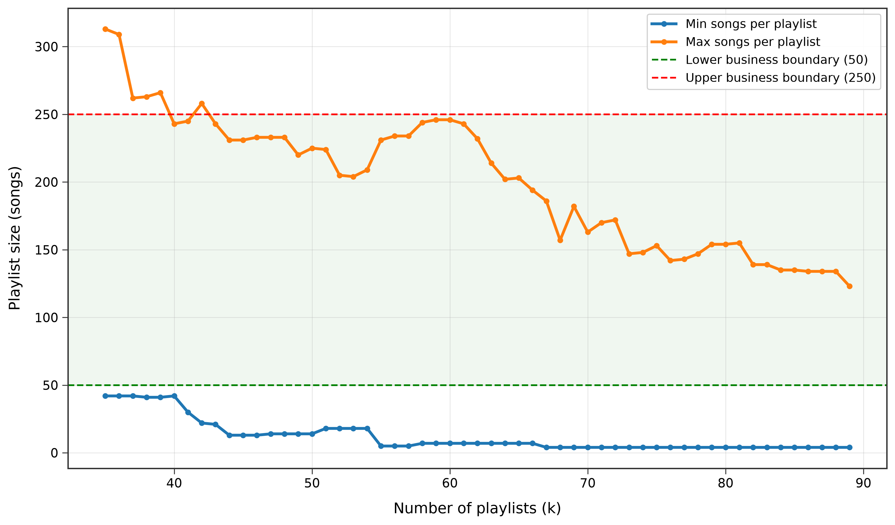
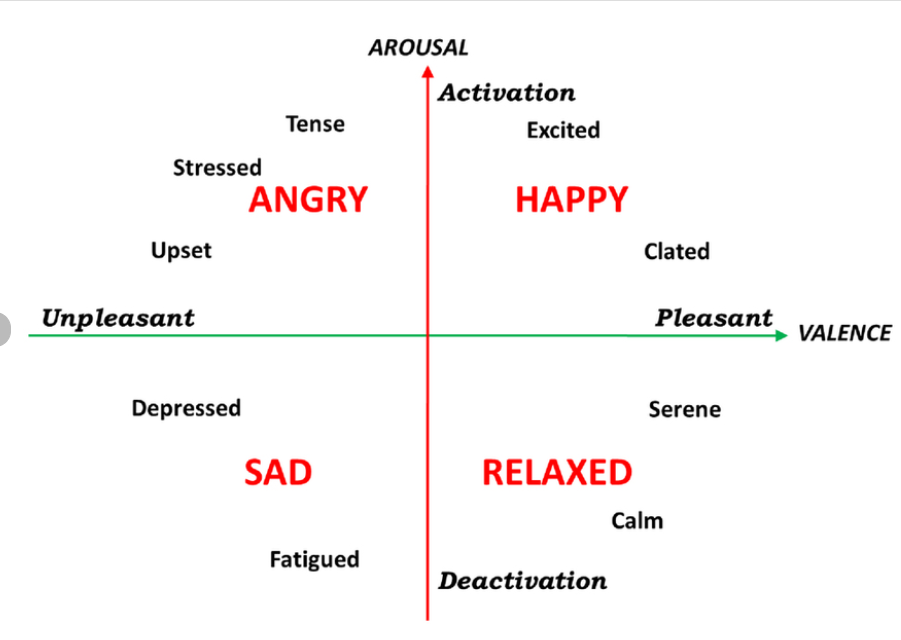

# 🎵 Moosic — Testing Automated Playlist Creation using Unsupervised Machine Learning

## Project Overview

**Can Data Science be used to automatically create playlists based on the mood and characteristics of songs?**

Moosic is a music start-up that creates curated playlists based on different moods and musical styles. As the business grows, manually creating playlists has become time-consuming, so this project explores how **Data Science and Machine Learning** can help automate the process.

The goal is to use **Spotify audio features** such as danceability, energy, tempo, and other characteristics to group similar songs into playlists using the **K-Means clustering algorithm**.

The business requires each generated playlist to contain **between 50 and 250 songs**.

---

## Business Questions

The project investigates two main questions:

1. **Can Spotify's audio features identify similar songs?**

   Can characteristics such as energy, danceability, tempo, and other audio features capture similarities that humans would recognize between songs?

2. **Is K-Means a suitable method for creating playlists?**

   Can clustering songs based on their audio features produce meaningful playlists, or should other clustering approaches be explored?

---
## Technologies Used

- Python
- pandas
- NumPy
- matplotlib
- seaborn
- Plotly
- scikit-learn
- Jupyter Notebook
- K-Means
- Min-Max Scaling

---
## Dataset

The project uses a dataset of approximately 5,000 songs containing Spotify audio features. The main audio features used in the analysis include:

- Danceability
- Energy
- Loudness
- Speechiness
- Acousticness
- Instrumentalness
- Liveness
- Valence
- Tempo
- Duration

---
## The script does the following therefore:
1. Data Preparation
      - Loads the Spotify dataset.
      - Checks the structure and data types.
      - Identifies missing values and duplicates.
      - Removes unnecessary columns.
      - Removes duplicate songs.
      - Selects the audio features used for clustering.

The cleaned dataset is then prepared for the machine-learning stage.

2. Feature Scaling
**Min-Max Scaling** is used to bring the features onto a comparable scale.
This is important because K-Means uses distances to determine which songs are similar. Without scaling, features with larger numerical ranges could have a greater influence on the clustering results.

3. K-Means Clustering

5. Choosing the Number of Clusters
The number of clusters is evaluated using both **machine-learning metrics** and the business requirement trying to match the business requirements.
Here there are a few steps done: KMeans, Elbow Method, Silhoouette Scores.

6. Mood Analysis
Because the goal is to create playlists based on mood, the analysis also looks at audio features that can contribute to a simplified representation of mood.
Features such as:
- Valence
- Energy
- Acousticness
are combined to create a **mood score**. The selection is based on both the Russell's circumplex mopdel and also the variance of different features.

The mood score can then be used to compare songs within the broader clusters and help organize them into playlists.

6. Creating the Playlists
At this point the final playlists are created and manually validated.

---
## Conclusion

This project demonstrates how **Unsupervised Machine Learning can be used to automate playlist creation**. In the end 27 playlists were created which meet the business requirements and of which most playlist set the same mood.

K-Means provides a useful starting point for identifying groups of songs based on Spotify audio features. However, because musical mood is subjective and the business imposes a specific playlist size, additional processing is required to turn the clusters into practical playlists. The results also highlight an important limitation: **musical mood is subjective**, and numerical audio features cannot fully capture how humans perceive music.

The final approach combines **clustering, mood analysis and business constraints** to create an initial automated playlist-generation prototype.
